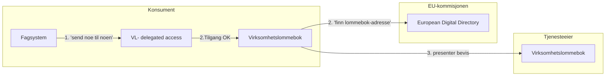
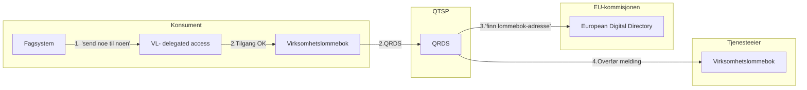
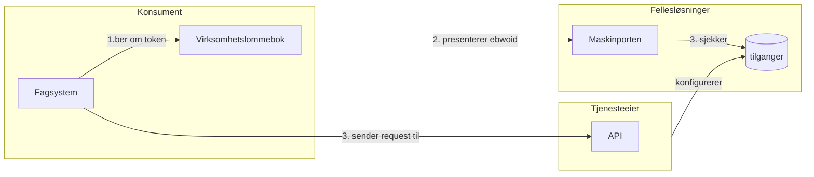
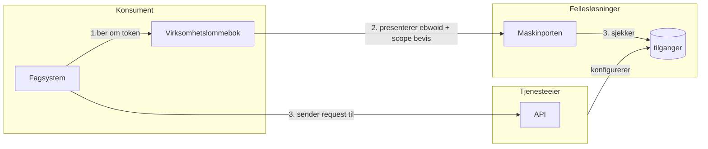
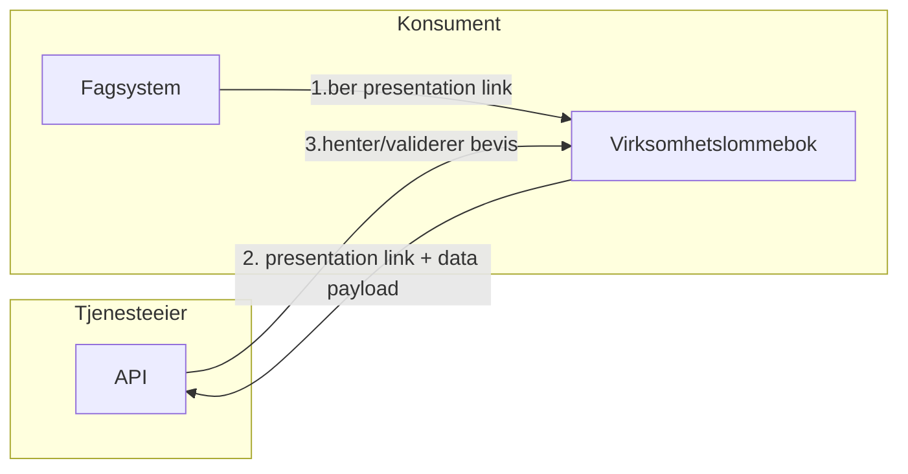
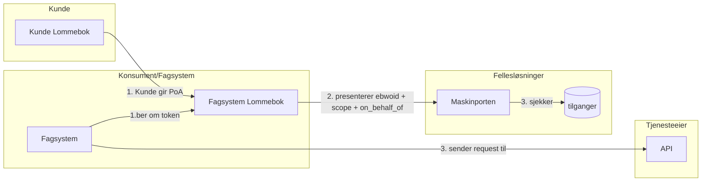
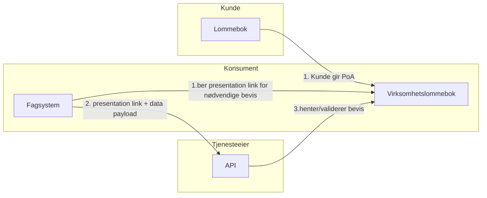

# Mønstre

## Fagsystem har delegert rettigheter i Virksomhetslommeboken til Kunden.
* Hvordan/Hva/omfang av delegering ?
### 0:  Bevis lommebok-til-lommebok

Ingen behov for Maskinporten.

* Utfordring i automatisk mottak av bevis.
* Sporing av formål / info om hvorfor noe blir sendt. 

### 1:  Data over QRDS lommebok-til-lommebok

Ingen behov for Maskinporten.

* Strukturert/ Ustrukturert data
* QRDS nasjonal struktur om mulig? -> Kostnadsdriver ?  

### 2. EBWOID erstatter virksomhetssertifikat
Tjenesteeier har et eksisterende API som er sikret med Maskinporten, ønsker å kunne dele også med "virksomhetslommebok".

Virksomhetslommeboken får her beskjed fra et internt fagsystem om at den må skaffe et maskinporten-token med et bestemt oauth2-scope. 
Vanlig maskinporten-flyt, men istedenfor virksomhetssertifikat brukes EBWOID. Enten presentert eller for å signere JWTen.
utfordringer:
- Presentasjon av bevis er tyngre enn sjekk av sertifikat. I det hele tatt egnet? 
- Maskinporten som tilgangssertifikat-utsteder basert på EBWOID-presentasjon?

### 3. EBWOID + Scope bevis ?

Gir det mening å forenkle helt? 

- hvilke bevis er det som mapper til tjenesteeiers scope?
    - Spesialiserte scope bevis for en spesifikk tjeneste? 
    - Gjenbruk av bevis - eks. Registrert finans-institusjon? -> Automatisk tilgang
- skal scope-tilganger fortsatt ligge i Maskinporten?
- Maskinporten skrive tilgangsbevis tilbake til virksomhetslommeboken? og så brukes dette direkte mot API ? 

## Fagsystem har egen lommebok, og fullmakter fra Kunde
### 0:  Generelt mot maskinporten: 

* Et fagsystem kan ikke lenger påstå å representere noen, de må faktisk bevise det gjennom en fullmakt. 
* Scope kan byttes ut med et bevis som impliserer scope

### 1: Fagsystem direkte mot API tilbyder
Vi ønsker et mønster der Fagsystemet bruker Bevis/EBWOID til å bevise sin identitet og rettigheter til APIet, samt å overføre dataen til APIet. 

* Hvordan gjøre presentation link brukbar ? Handoff i OpenID4VCP prosessen?
* Legge ved Bevis istedenfor direkte til APIet? 
* Trigge API-tjenestetilbyder til å generere en credential request først? 